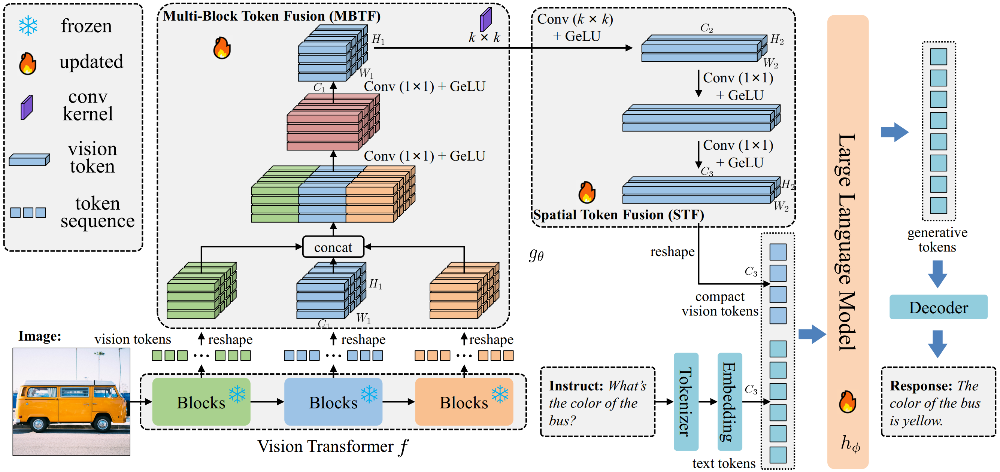
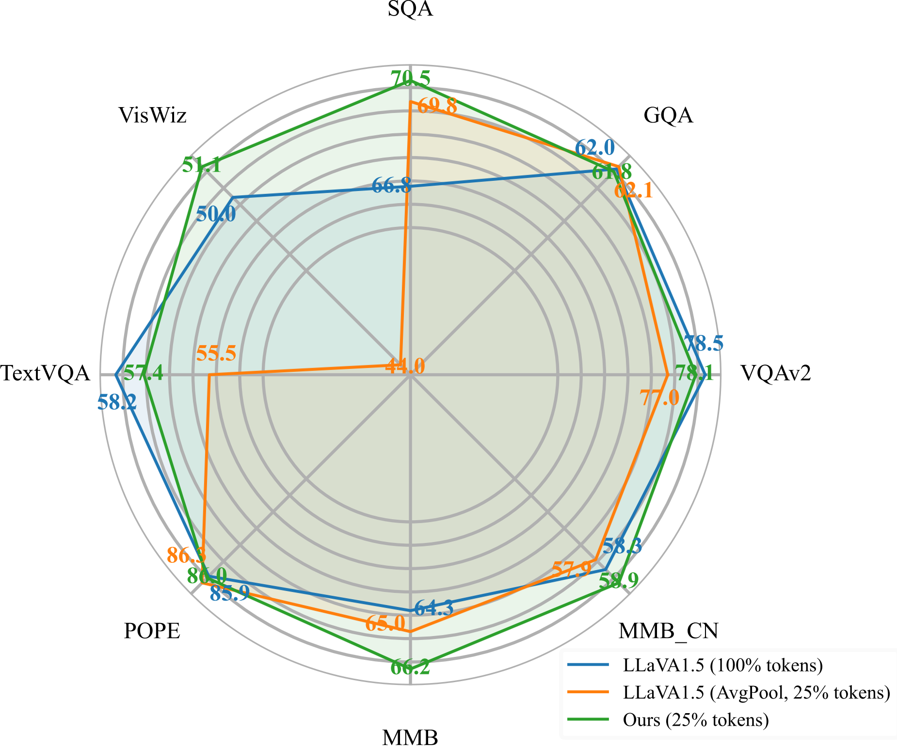

## Learning Compact Vision Tokens for Efficient Large Multimodal Models

This repository is the official implementation of "Learning Compact Vision Tokens for Efficient Large Multimodal Models".

[[Paper](https://arxiv.org/abs/2506.07138)]    [[BibTex](#Citation)]   [[HuggingFace](https://huggingface.co/visresearch/LLaVA-STF/tree/main)]



**LLaVA-STF** explores the **spatial redundancy among vision tokens** and **shorten the length of vision token sequences** for **inference acceleration**, where spatial-adjacent tokens are fused into one. 

Meanwhile, weight-frozen vision encoder can not well adapt to the demand of extensive downstream vision-language tasks. To this end, we further introduce a Multi-Block Token Fusion (MBTF) module to supplement multi-granularity features for the reduced token sequence. Overall, we combine STC and MLTC module to balance token reduction and information preservation, thereby improving inference efficiency without sacrificing multimodal reasoning capabilities. 

Experimental results demonstrate that our method based on LLaVA-1.5 achieves comparable or even superior performance to the baseline on 8 popular vision-language benchmarks with only 25% vision tokens of baseline. 

The main results are illustrated in the below figure.



### Install

1. Clone this repository and navigate to LLaVA folder
```bash
git clone [link]
cd LLaVA
```

2. Install Package
```bash
conda create -n llava python=3.10 -y
conda activate llava
pip install --upgrade pip 
pip install -e .
```

3. Install additional packages for training cases
```bash
pip install -e ".[train]"
pip install flash-attn --no-build-isolation
```

### Training

We follow the original LLaVA to conduct two-stage training: a pretraining stage for feature alignment, and a full parameter fine-tuning stage for visual instruction tuning.
The training details are as follows.

1. Download the training data for both pretraining and fine-tuning from the original LLaVA repository.
2. Run the following command to pretrain the model:
    ```bash
    bash scripts/v1_5/pretrain.sh
    ```
3. Run the following command to fine-tune the model:
    ```bash
    bash scripts/v1_5/finetune.sh
    ```

### Hyperparameters
We use a similar set of hyperparameters as the original LLaVA.  Both hyperparameters used in pretraining and fine-tuning are provided below.

1. Pretraining

| Hyperparameter | Global Batch Size | Learning rate | Epochs | Max length | Weight decay |
| --- | ---: | ---: | ---: | ---: | ---: |
| LLaVA-v1.5-7B | 256 | 1e-3 | 1 | 2048 | 0 |

2. Fine-tuning

| Hyperparameter | Global Batch Size | Learning rate | Epochs | Max length | Weight decay |
| --- | ---: | ---: | ---: | ---: | ---: |
| LLaVA-v1.5-7B | 128 | 2e-5 | 1 | 2048 | 0 |

### Model Weights
| Model | Schedule | Checkpoint | VQAv2 | GQA | VizWiz | SQA | TextVQA | POPE | MME | MM-Bench | MM-Bench-CN |
|----------|-----------|-----------|:-:|:-:|:-:|:-:|:-:|:-:|:-:|:-:|:-:|
| LLaVA-v1.5-7B (pretrain) | 1 epoch | [download](https://huggingface.co/visresearch/LLaVA-STF/tree/main/pretrain/LLaVA-vicuna-1.5-7B) | / | / | / | / | / | / | / | / | / |
| LLaVA-v1.5-7B (finetune) | full_ft-1e | [download](https://huggingface.co/visresearch/LLaVA-STF/tree/main/full-parameter-finetune) | 78.1 | 61.9 | 51.1 | 70.5 | 57.4 | 86.0 | 1482.8 | 66.2 | 58.9 |

### Evaluation

We evaluate models on the following 9 benchmarks.

#### VQAv2

1. Download [`test2015`](http://images.cocodataset.org/zips/test2015.zip) and put it under `./playground/data/eval/vqav2`.
2. Multi-GPU inference.
```Shell
CUDA_VISIBLE_DEVICES=0,1,2,3,4,5,6,7 bash scripts/v1_5/eval/vqav2.sh
```
3. Submit the results to the [evaluation server](https://eval.ai/web/challenges/challenge-page/830/my-submission).

#### GQA

1. Download the [data](https://cs.stanford.edu/people/dorarad/gqa/download.html) and [evaluation scripts](https://cs.stanford.edu/people/dorarad/gqa/evaluate.html) following the official instructions and put under `./playground/data/eval/gqa/data`.
2. Multi-GPU inference.
```Shell
CUDA_VISIBLE_DEVICES=0,1,2,3,4,5,6,7 bash scripts/v1_5/eval/gqa.sh
```

#### VisWiz

1. Download [`test.json`](https://vizwiz.cs.colorado.edu/VizWiz_final/vqa_data/Annotations.zip) and extract [`test.zip`](https://vizwiz.cs.colorado.edu/VizWiz_final/images/test.zip) to `test`. Put them under `./playground/data/eval/vizwiz`.
2. Single-GPU inference.
```Shell
CUDA_VISIBLE_DEVICES=0 bash scripts/v1_5/eval/vizwiz.sh
```
3. Submit the results to the [evaluation server](https://eval.ai/web/challenges/challenge-page/2185/my-submission).

#### ScienceQA

1. Under `./playground/data/eval/scienceqa`, download `images`, `pid_splits.json`, `problems.json` from the `data/scienceqa` folder of the ScienceQA [repo](https://github.com/lupantech/ScienceQA).
2. Single-GPU inference and evaluate.
```Shell
CUDA_VISIBLE_DEVICES=0 bash scripts/v1_5/eval/sqa.sh
```

#### TextVQA

1. Download [`TextVQA_0.5.1_val.json`](https://dl.fbaipublicfiles.com/textvqa/data/TextVQA_0.5.1_val.json) and [images](https://dl.fbaipublicfiles.com/textvqa/images/train_val_images.zip) and extract to `./playground/data/eval/textvqa`.
2. Single-GPU inference and evaluate.
```Shell
CUDA_VISIBLE_DEVICES=0 bash scripts/v1_5/eval/textvqa.sh
```

#### POPE

1. Download `coco` from [POPE](https://github.com/AoiDragon/POPE/tree/e3e39262c85a6a83f26cf5094022a782cb0df58d/output/coco) and put under `./playground/data/eval/pope`.
2. Single-GPU inference and evaluate.
```Shell
CUDA_VISIBLE_DEVICES=0 bash scripts/v1_5/eval/pope.sh
```

#### MME

1. Download the data following the official instructions [here](https://github.com/BradyFU/Awesome-Multimodal-Large-Language-Models/tree/Evaluation).
2. Downloaded images to `MME_Benchmark_release_version`.
3. put the official `eval_tool` and `MME_Benchmark_release_version` under `./playground/data/eval/MME`.
4. Single-GPU inference and evaluate.
```Shell
CUDA_VISIBLE_DEVICES=0 bash scripts/v1_5/eval/mme.sh
```

### MMBench

1. Download [`mmbench_dev_20230712.tsv`](https://download.openmmlab.com/mmclassification/datasets/mmbench/mmbench_dev_20230712.tsv) and put under `./playground/data/eval/mmbench`.
2. Single-GPU inference.
```Shell
CUDA_VISIBLE_DEVICES=0 bash scripts/v1_5/eval/mmbench.sh
```
3. Submit the results to the [evaluation server](https://opencompass.org.cn/leaderboard-multimodal).

### MMBench-CN

1. Download [`mmbench_dev_cn_20231003.tsv`](https://download.openmmlab.com/mmclassification/datasets/mmbench/mmbench_dev_cn_20231003.tsv) and put under `./playground/data/eval/mmbench`.
2. Single-GPU inference.
```Shell
CUDA_VISIBLE_DEVICES=0 bash scripts/v1_5/eval/mmbench_cn.sh
```
3. Submit the results to the [evaluation server](https://opencompass.org.cn/leaderboard-multimodal).


### License

This project is under the CC-BY-NC 4.0 license. See [LICENSE](LICENSE) for details.

### Citation

```bibtex
@article{tang2025compact,
  author  = {Tang, Hao and Shen, Chengchao},
  title   = {Learning Compact Vision Tokens for Efficient Large Multimodal Models},
  journal = {arXiv preprint arXiv:2506.07138},
  year    = {2025},
}
```

